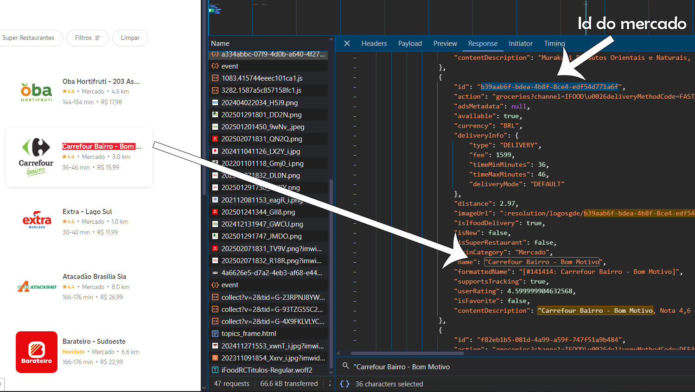
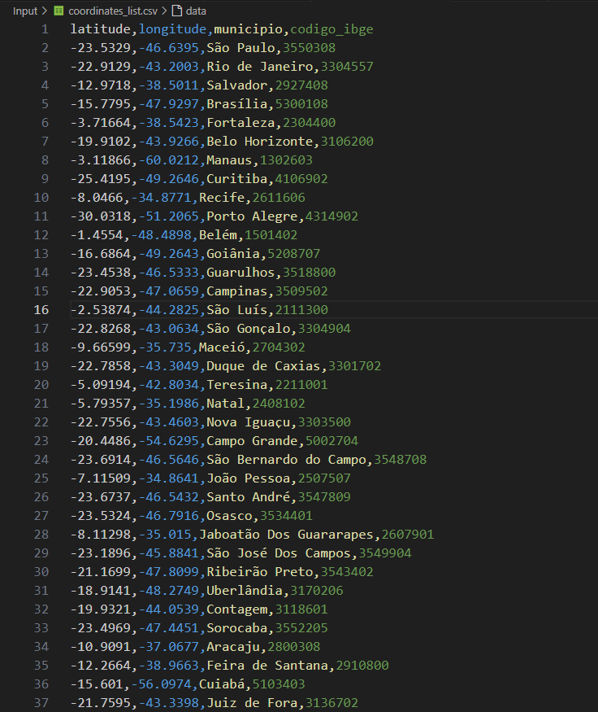
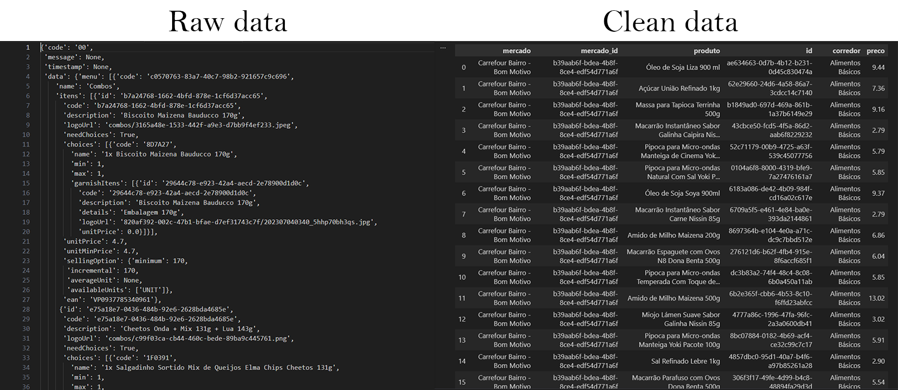
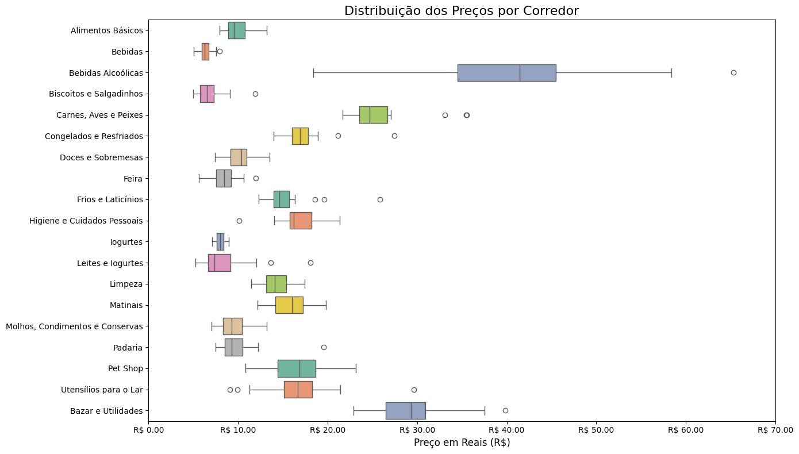
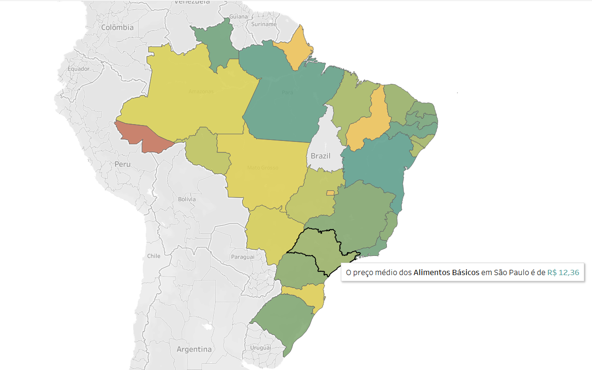
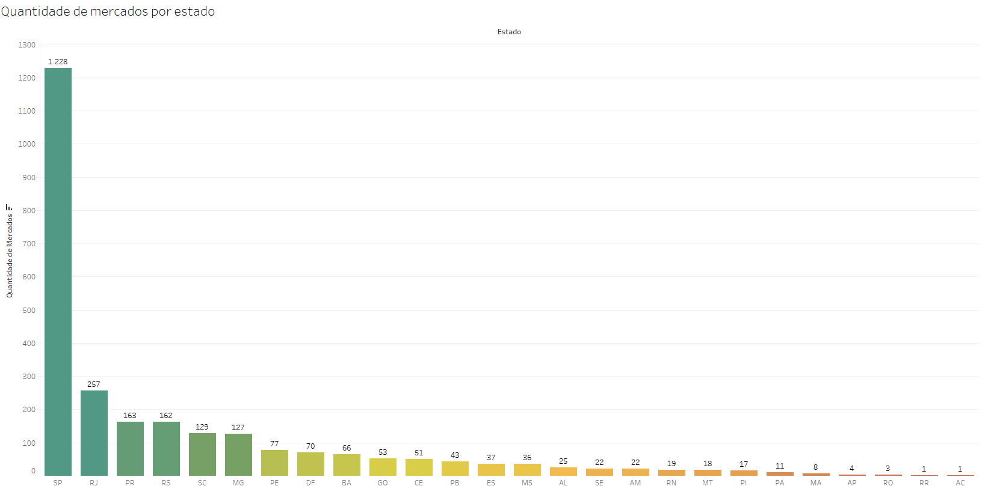

# 🛒 iFood Price Analysis - Data Science Project  

This repository documents my project on analyzing supermarket prices on iFood. From data collection and processing to analysis and visualization, I used web scraping, ETL techniques, databases, and data visualization tools.  

---

## 📌 1. Introduction  

### 🎯 Goal  
The goal of this project was to analyze the prices of supermarket products sold through iFood, Brazil’s largest food delivery app. To achieve this, I used web scraping techniques to collect data directly from the platform, performed data processing, and created insightful visualizations.  

### 🚀 Technologies Used  
- **Python** (requests, pandas, matplotlib, SQLAlchemy, etc.)  
- **MySQL** (data storage)  
- **AWS** (cloud database)  
- **Tableau** (data visualization)  

---

## 🔍 2. Data Collection  

### 🕵️‍♂️ 2.1. How iFood Works  

To understand how iFood displays supermarkets and products, I used the **Inspect Element** tool in the browser (**Network** tab) to find the APIs used by the site.  

✅ **Key Discoveries:**  
- iFood uses **Google Maps** to convert addresses into coordinates.  
- The website displays available supermarkets based on customer distance and supermarket choices.  
- Each supermarket has a **unique ID**.  

🖼️ **Screenshot: Inspecting iFood’s website**  
  

---

### 🌎 2.2. Getting Coordinates  

To access supermarkets throughout Brazil, I needed coordinates for all cities. Larger cities required multiple coordinates.  

📂 **Result:**  
- A CSV file with **X rows**, covering a large part of Brazil.  

🖼️ **Screenshot: Generated coordinates CSV**  
  

---

## ⚙️ 3. Data Extraction & Processing  

After sending coordinates to iFood, I retrieved lists of supermarkets and collected the products they sold.  

❗ **Challenges:**  
- The API response contained **outdated and irrelevant tags**.  
- I used **data mining and ETL** techniques to clean the data.  

✅ **Result:**  
- Organized data including:  
  - **Product name**  
  - **Category (aisle)**  
  - **Price**  
  - **Supermarket ID**  

🖼️ **Screenshot: Raw vs. processed data**  
  

---

## 🗄️ 4. Database Storage  

I stored the data in **MySQL**, both locally and in **AWS**.  

📊 **Database Stats:**  
- **15M+ rows** collected.  
- SQL queries for:  
  - **Average price per state**.  
  - **Price comparison between supermarkets**.  
  - **Price distribution by category**.  

🖼️ **Screenshot: Database infos**  
  

---

## 📊 5. Data Visualization  

I used **Python and Tableau** to create charts and understand price distribution.  

🖼️ **Example of visualizations I created**  
  
  
  
  

As we can see in the last chart, several states have very few supermarkets available on iFood, making it impossible to accurately analyze the true average prices in these markets using only iFood data. Therefore, I am developing a method to gather more supermarket data from these states, most likely by utilizing the official websites of the supermarkets. This will also allow me to compare their prices with those available on iFood.

---

## 🎯 6. Conclusion  

This project demonstrated **web scraping, ETL, database management, and data visualization** techniques to analyze iFood prices.  

🚀 **Future improvements:**  
- Automate data updates.
- Find a new data source for more supermarkets.
- Apply machine learning for price prediction.  
